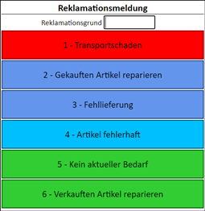
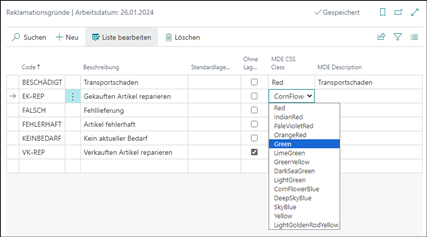

# Individualize Your DATACAP+ Interface with CSS: A Stylish Example

Welcome to the DATACAP+ CSS Example! Here, we demonstrate how you can seamlessly tailor the DATACAP+ user interface to match your unique preferences using custom CSS.

## What's Inside

In this package, you'll find the following key components:

- **Custom.css**: A CSS file that acts as your creative canvas. By placing this file into your DATACAP+ installation's data directory and specifying it in the [`CSSFilename`](https://datacap.plus/en/documentation/configuration/datacap-plus/#property-cssfilename) configuration, you unlock a world of design possibilities.

- **DATACAP+ CSS Example App**: Explore our Business Central App that showcases the power of CSS classes in action.

## Visual Preview

Behold the allure of your customized interface! Feast your eyes on the screenshot below:

Get ready to dive into a realm where your DATACAP+ interface becomes an expression of your unique style and needs. Let's unleash the artistry of CSS upon your data capture journey!

Remember, innovation knows no bounds when you combine DATACAP+ with your imagination and the prowess of CSS. Let's get creative!
