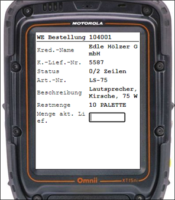

# DATACAP+ Standard MDE-Anwendungen

Dieses öffentlich zugängliche Git-Repository enthält den Quellcode (in C/AL) von MDE-Anwendungen für einige Standardprozesse innerhalb von Dynamics NAV bzw. Dynamics 365 Business Central. Die MDE-Anwendungen basieren auf der [DATACAP+](https://datacap.plus/) Software.

## Wareneingang

Die MDE-Anwendung für den Wareneingangsprozess ([`Codeunit 5496960 AGO DC App Whse. Receipt`](Codeunit_0005496960.txt)) unterstützt die Vereinnahmung von Artikeln aus unterschiedlichen Herkunftsbelegen:

- EK-Bestellung
- Lagereinlagerung
- Wareneingang

