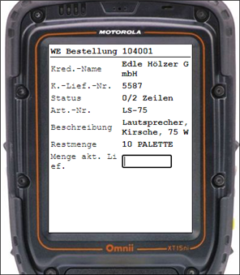

# Warehouse Receipt Example in C/AL with DATACAP+

Welcome to the DATACAP+ C/AL Example for posting Warehouse Receipts in Dynamics NAV. The example supports the receipt of items from different source documents:

- Purchase order
- Inventory Put-aways
- Warehouse Receipts

